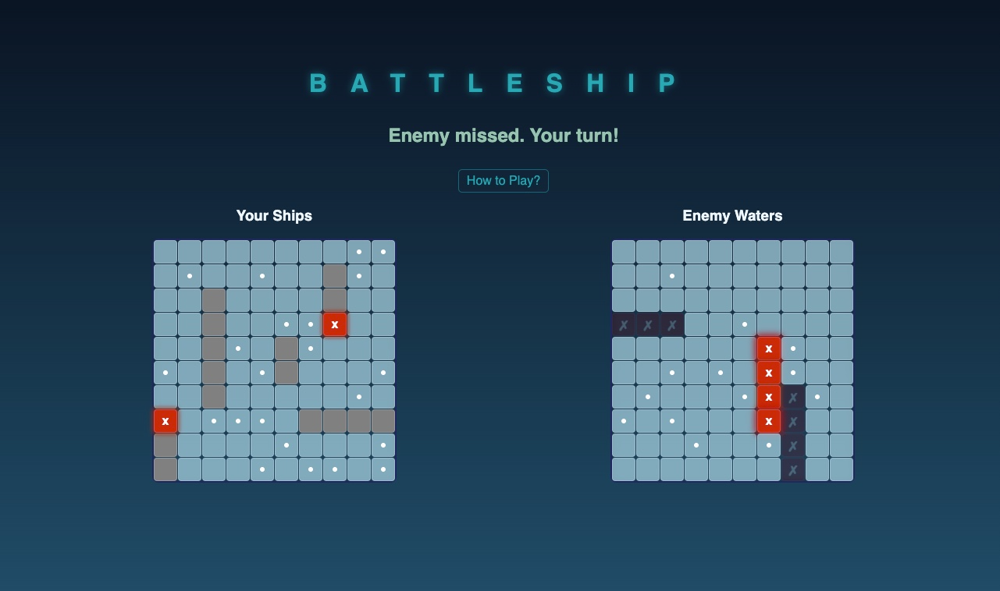
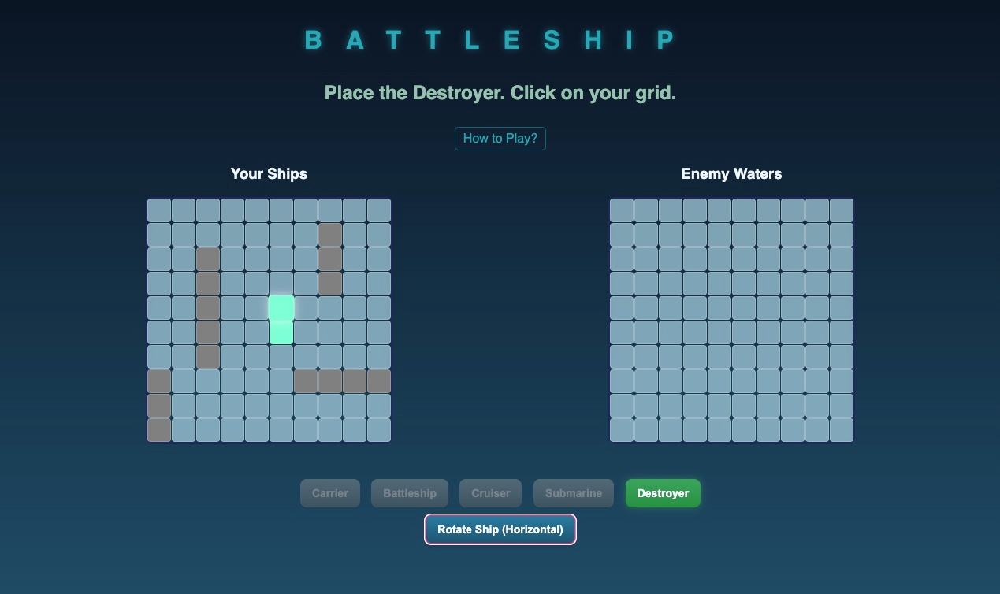

# Battleship Game

## Description

A classic game of Battleship implemented in HTML, CSS, and JavaScript. Players place their ships on a grid and take turns firing at the opponent's grid to sink their fleet.

## Getting Started

*   **Play the deployed game:** https://mikebrown0409.github.io/BattleShip/
*   **Instructions:** Instructions are included within the game interface.

## Technologies Used

*   HTML
*   CSS
*   JavaScript

## Attributions

*   MDN Web Docs
*   StackOverflow
*   GeminiStudio - favicon generation

## Next Steps (Future Enhancements)

*   **Atmospheric Effects:** Enhance visual immersion with dynamic CSS effects like storms, rolling waves, lightning, and rain. Integrate accompanying audio (e.g., thunder).
*   **Local Multiplayer:** Implement a "hot-seat" mode allowing two players to compete on the same device.
*   **Online Multiplayer:** Develop real-time multiplayer functionality enabling players to compete against each other over the internet.
*   **Improved AI:** Implement a more strategic AI opponent (e.g., "hunting" mode after scoring a hit).
*   **Sound Effects:** Add sounds for firing, hits, misses, sinking ships, and UI interactions.
*   **Enhanced Animations:** Improve visual feedback with smoother animations for game events.
*   **Game Variants:** Consider adding modes like Salvo (multiple shots per turn).
*   **Score Tracking:** Implement win/loss statistics.
